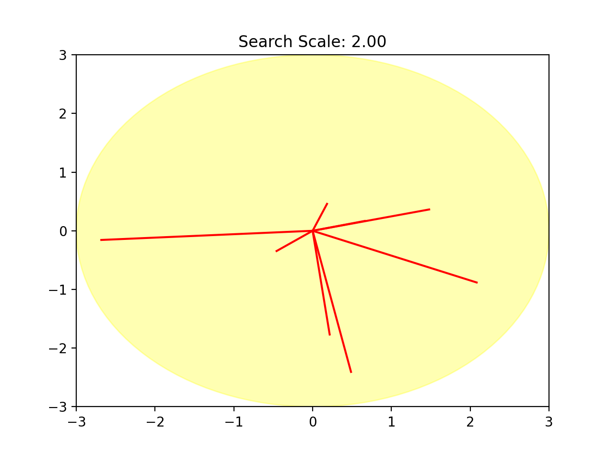

# BlackBoxOptimizerSPcomparison
A comparison of Black Box optimizers for source separation and RNN.

This repository is for the [paper](HSCMA2024_SourceSeparation_na.pdf) and [poster](BlackBoxOptimPoster.pdf): 

Gerald Schuller: "Fast Black-Box Optimizers for Low Delay Audio Source Separation", ICASSP 2024 satellite workshop HSCMA 2024, Seoul, Korea, and my poster at the [Speech and Audio in the Northeast 2024](https://www.saneworkshop.org/sane2024/) Workshop. 
It also contains the slides for the [talk at Tandom School of Engineering of New York University in September 2024](BlackBoxOptimPresentation.pdf)

Video demos for the talk:

  
[video2](random_directions_animation_shifted_center.mp4)
showing the wandering around in the search space.

This repository contains the software, models, and results text files for a comparison of different Black Box optimizers, including the Random Directions algorithm.

The main program are: 
- ICAabskl_puredelay_multichan_randdir_online.py for the source separation optimizers
- pytorch_rnn_IIR.py for the RNN optimizers

The optimizers can be chosen in the main programs, by uncommenting the appropriate line. The optimnization is run 10 times, and for each optimization run the obtained objective function or loss function value and needed run time are looged in the corresponding txt file.

For the text files in this repository, the hardware was a processor with 8 CPU cores, each running at 1.8 GHz. Observe that with Colab you will get somewhat different results because it usually just provides 2 cores. 
Hence it is recommended to let it run locally, but then it likely needs a virtual environment  for pypop7. A virtual environment can be created, for instance, with

pip install virtualenv

virtualenv pypop7

#activate:

source ~/pypop7/bin/activate

pip install pypop7

#deactivate with:

deactivate

To let the jupyter notebook "sourceSeprationBlackBoxComp.ipynb" run in Colab is more convenient, because it is its own envirnmonent and installs everything needed, but it is usually slower:

The program "ICAabskl_puredelay_multichan_randdir_online.py" has a mode which plots instead of writing the results to file. It can be set in its line 285, with the function call with "plot=True". It can also play the separated sound if on line 575 soundplay=True. It needs pyaudio, which Colab doesn't have, so it needs to be run locally if audio output is desired.

More Information and examples for the source separation application can be found in our repository 

https://github.com/TUIlmenauAMS/LowDelayMultichannelSourceSeparation_Random-Directions_Demo

The program "pytorch_rnn_IIR.py" has a demo mode, where it announces and plots and plays the generated sound, instead of just writing the results to file. It can be enabled in its line 34 with demomode=True" and enabling "import soundfloat" on line 23. Soundfloat needs the module "pyaudio", so it needs to be run locally.

Gerald Schuller, September 2023
